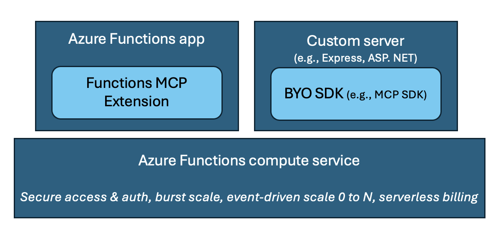

# Host remote MCP servers built with official MCP SDKs on Azure Functions

This repo contains instructions and samples for how to turn an MCP server built with the Node MCP SDK into a custom app that can be run on Azure Functions. The repo uses the weather sample server to demonstrate how this can be done. You can clone to run and test the server locally, follow by easy deploy with `azd up` to have it in the cloud in a few minutes. You can follow the instructions provided to manually add the required Functions related artifacts, or have Visual Studio Code's Copilot make those additions for you by using the experimental prompt provided. 

Find the repo for other languages
| Language (Stack) | Repo Location |
|------------------|---------------|
| C# (.NET) | [dotnet-mcp-sdk-functions-hosting]() |
| Python | [python-mcp-sdk-functions-hosting]() |

## Running MCP server as custom handler on Azure Functions
Recently Azure Functions released the [Functions MCP extension](https://techcommunity.microsoft.com/blog/appsonazureblog/build-ai-agent-tools-using-remote-mcp-with-azure-functions/4401059), allowing developers to build MCP servers using Functions programming model, which is essentially Function's event-driven framework, and host them remotely on the serverless platform. 

For those who have already built servers with Anthropic's MCP SDKs, it's also possible host the servers on Azure Functions by turning them into _custom handlers_, which are lightweight web servers that receive events from the Functions host. They allow you to host your already-built MCP servers with minimal code change and benefit from Function's bursty scale, serverless pricing model, and security features.  

<div align="center">
  
</div>

## Quickstart
The sample server in this repo is already converted into a custom handler and can be deployed as is by doing the following:

1. Clone the repo
    ```
    git clone https://github.com/Azure-Samples/node-mcp-sdk-functions-hosting.git
    ```
1. Install the [Azure Developer CLI](https://learn.microsoft.com/azure/developer/azure-developer-cli/install-azd)
1. Open up the sample in VSCode and run `azd up` in the root directory

The last step will create a resource group with all the required resources, as well as deploy the server to Azure.

### Test deployed server
After deployment completes, go to the Function App resource on Azure portal to find the app's endpoint and key: Click on **function-route** -> **Get function URL** -> copy the second endpoint with Function key. It should look like:

```
https://<function app name>.azurewebsites.net/{*route}?code=<key>
```

Test on Visual Studio Code (or your favorite client):
1. Open the command palette (`cntrl/cmd+shift+p`) and search for **MCP: Add server**
2. Choose **HTTP**
3. Enter the function endpoint from above, replace `{*route}` with `mcp`

## Convert Node MCP server to custom handler

If you have already have server, follow instructions below to add the required Azure Functions project artifacts to convert it to a custom handler. 

If you're using Visual Studio Code, you could try out the [experimental prompt](#use-experimental-prompt) approach instead of making the additions manually. The prompt has intructions for Copilot to follow for converting the server. 

### Server requirements

Your server must be stateless and uses the streamable HTTP transport for hosting on Azure Functions today. 

### Add required artifacts 
1. In the root directory of your MCP server project, create a `host.json` with the following:
    ```json
    {
        "version": "2.0",
        "extensions": {
            "http": {
                "routePrefix": ""
            }
        },
        "customHandler": {
            "description": {
                "defaultExecutablePath": "node",
                "workingDirectory": "",
                "arguments": ["<path to compiled JavaScript file (e.g., server.js)>"]
            },
            "enableForwardingHttpRequest": true,
            "enableHttpProxyingRequest": true
        }
    }
    ```
    >![NOTE] Use `node` instead of `npm` as the executable path because the latter is not supported today. 

1. Create a folder named `function-route` in the root directory. Inside the folder, create a file named `function.json` with the following:
    ```json
    {
        "bindings": [
            {
                "authLevel": "function",
                "type": "httpTrigger",
                "direction": "in",
                "name": "req",
                "methods": ["get", "post", "put", "delete", "patch", "head", "options"],
                "route": "{*route}"
            },
            {
                "type": "http",
                "direction": "out",
                "name": "res"
            }
        ]
    }
    ```
    This file marks the MCP server as an HTTP trigger to the Functions host, allowing access to the server through an HTTP endpoint. Functions allows you to use access keys to make it harder to access function endpoints. In this case, the line `"authLevel": "function"` specifies that a key must be included in the request when accessing the MCP server. 

1. Again in the root directory, create a `local.settings.json` file with the following:

    ```json
    {
        "IsEncrypted": false,
        "Values": {
            "FUNCTIONS_WORKER_RUNTIME": "custom"
        }
    }
    ```
    This file is where all the environment variables are kept. 

### Set custom handler port for server to listen to 
Modify the MCP server code to listen for HTTP requests on the port specified by the `FUNCTIONS_CUSTOMHANDLER_PORT` environment variable. For example: 

```typescript
  const PORT = process.env.FUNCTIONS_CUSTOMHANDLER_PORT || process.env.PORT || 3000;
  app.listen(PORT, (error?: Error) => {
    // code
  });
```

That's it! These are all the changes you need before deploying your MCP server to Azure Functions. 

### Test local server 

Install [Azure Functions Core Tools](https://learn.microsoft.com/azure/azure-functions/functions-run-local?tabs=windows%2Cisolated-process%2Cnode-v4%2Cpython-v2%2Chttp-trigger%2Ccontainer-apps&pivots=programming-language-typescript) if you haven't already. 

In the root directory, run `func start` to run the server locally as a custom handler. Test by adding the localhost url to your favorite client. 

## Deploy MCP server to Azure Functions
1. [Create a Function app](https://learn.microsoft.com/azure/azure-functions/functions-create-function-app-portal?tabs=core-tools&pivots=flex-consumption-plan) on the Flex Consumption plan and related resources. Choose **Node 20 or 22** as the runtime stack and version. 
1. Deploy the server by running the following command in the root directory:
    ```azcli
    func azure functionapp publish <function app name>
    ```
1. Follow steps in [Test deployed server](#test-deployed-server) to test. 

## Use experimental prompt
Instead of manually making the additions above, you can try out the [Azure Functions MCP server converter](https://raw.githubusercontent.com/anthonychu/create-functions-mcp-server/refs/heads/main/prompts/create-functions-mcp-server.prompt.md
) and have VSCode's Copilot follow the prompt's instructions to make those changes for you. 


## Server authorization using Azure API Management (APIM)
In addition to protecting your server though function keys, you can also leverage APIM to add server authorization with Entra ID. 

[TODO] 

